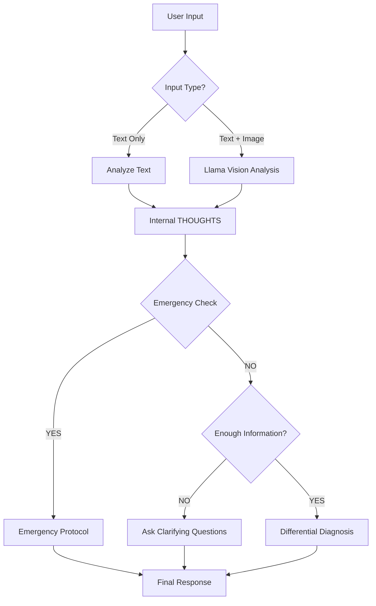
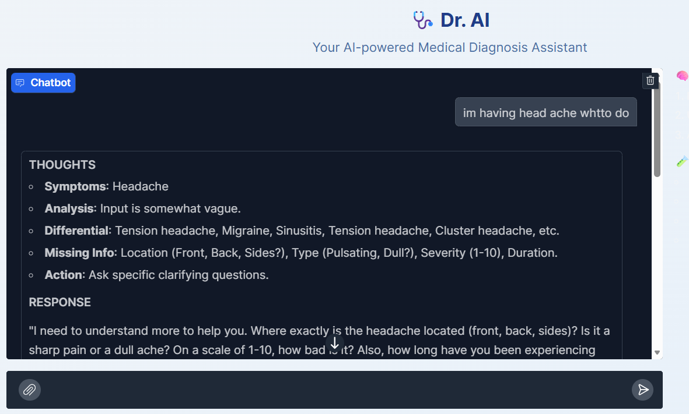
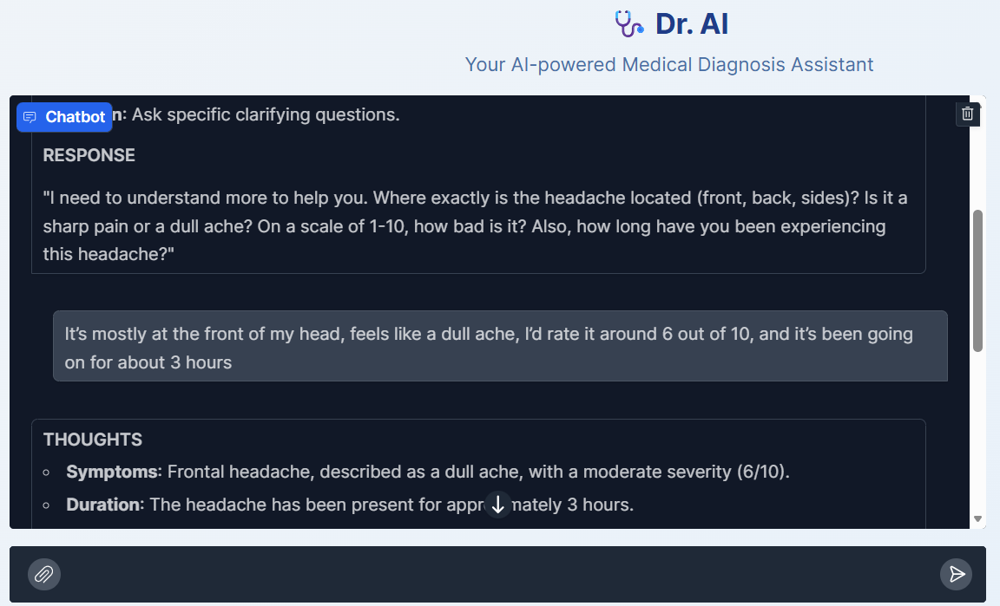
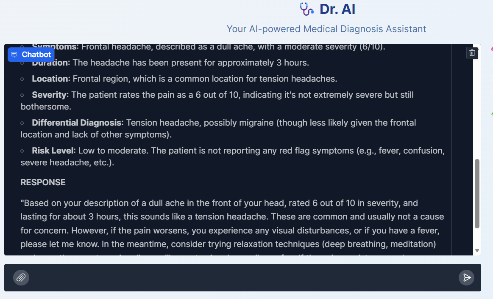
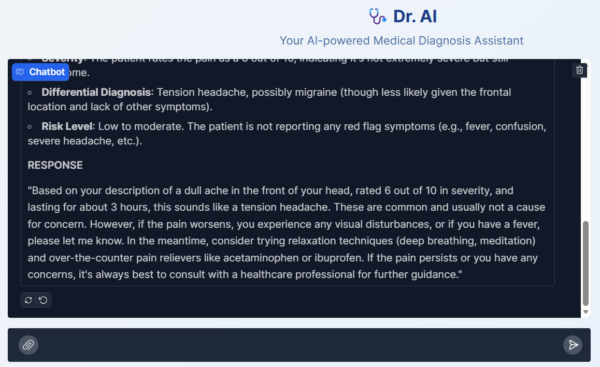

# 🩺 Dr. AI – Multimodal Medical Triage Assistant

> A **cognitive medical AI agent** that can *see, think, and reason* before providing medical triage guidance.

---

## 🧠 What is Dr. AI?

**Dr. AI** is not a conventional chatbot. It is a **multimodal medical triage agent** built using a **cognitive architecture** that enforces structured medical reasoning.

Instead of generating instant (and often hallucinated) answers, Dr. AI strictly follows a medical-style pipeline:

> **Analyze → Think → Respond**

It leverages **vision + language intelligence** to evaluate both **textual symptoms** and **medical images** (X‑rays, rashes, injuries, eye conditions) before producing a **differential diagnosis** or **emergency triage recommendation**.

---

## ✨ Key Capabilities

### 👁️ Multimodal Vision Intelligence

* **Image Understanding**: Accepts uploads of skin conditions, injuries, lab reports, and more
* **Visual Feature Analysis**: Evaluates color, shape, borders, and patterns
* **Clinical Comparison**: Differentiates visually similar conditions (e.g., *Ringworm vs. Eczema*)

---

### 🧠 Cognitive Architecture (LangGraph)

Dr. AI is powered by a **state-driven reasoning engine** instead of a single prompt.

#### 🔍 Internal Reasoning (Hidden)

* Generates a private **THOUGHTS** block to verify logic
* Ensures safe and consistent reasoning before replying

#### 🔁 Medical Triage Loops

* **Loop A – Clarification Mode**
  Triggered when symptoms are vague or insufficient

* **Loop B – Emergency Mode**
  Activated when critical red flags are detected (e.g., chest pain, stroke symptoms)

---

### 🛡️ Safety Guardrails

* 🚨 **Emergency Interception** for:

  * Heart Attack
  * Stroke
  * Sepsis
* 📜 **Automatic Medical Disclaimers** appended to non‑emergency responses
* ❌ Diagnosis is **aborted immediately** in emergency scenarios

---

### 💻 Modern Medical UI

* **Gradio Web Interface** with a clinical theme
* **Drag‑and‑Drop Image Uploads**
* Clean, minimal, and patient‑friendly layout

---

## 🛠️ Tech Stack

| Component       | Technology             | Purpose                                 |
| --------------- | ---------------------- | --------------------------------------- |
| 🧠 Model        | Llama 3.2 Vision (11B) | Multimodal reasoning over text + images |
| ⚙️ Runner       | Ollama                 | Local LLM inference engine              |
| 🔁 Orchestrator | LangGraph              | Cognitive state & reasoning loops       |
| 🖥️ Frontend    | Gradio                 | Web UI & image handling                 |
| 🚀 Hardware     | NVIDIA T4 GPU          | Efficient vision encoder execution      |

---

## 🚀 Quick Start (Google Colab)

> ⚠️ **GPU Required** — Vision models require a CUDA‑enabled runtime

### Prerequisites

* Google Account
* **GPU Runtime Enabled**
  `Runtime → Change runtime type → T4 GPU`

---

### Installation & Run

Copy the main script into a Colab cell. It will automatically:

* Install `ollama`, `langgraph`, and `gradio`
* Start the local AI inference server
* Download **Llama‑3.2‑Vision (~6GB)**

```bash
# Run the Gradio Medical Assistant
python Medical_Bot_Gradio_UI.py
```

---

## 🧠 System Architecture – How Dr. AI Thinks

The core decision logic lives inside the **`doctor_node`**.
Each user interaction follows the pipeline below:



---

## 🧪 Example Scenarios

### 🖼️ Visual Diagnosis

**User Input**

> Uploads image of a red circular rash on the arm

**Dr. AI – Internal Reasoning**

* Circular lesion
* Raised border
* Clear center

**Diagnosis Match**: *Tinea Corporis (Ringworm)*

**Response**

> "This visual pattern is consistent with Ringworm. An antifungal cream is typically recommended..."

---

### 🚨 Emergency Interception

**User Input**

> "My dad’s face is drooping and he can’t speak"

**Dr. AI – Internal Reasoning**

* Facial droop
* Slurred speech
* FAST protocol triggered

**Response**

> 🚨 **EMERGENCY**: These are signs of a **STROKE**. Call emergency services immediately. *Time is brain.*

---

## 📸 Screenshots & Usage Demos

Below are real examples of Dr. AI in action:

| **Dr. AI Interface** | **Medical Diagnosis Example** |
| :---: | :---: |
|  |  |

| **Visual Analysis** | **Emergency Protocol** |
| :---: | :---: |
|  |  |

---

## ⚠️ Disclaimer

> **Educational & Research Use Only**

* Dr. AI is **NOT a licensed medical professional**
* Powered by an LLM that may hallucinate or err
* **Never** rely on this system for real medical emergencies
* Always consult a certified healthcare provider

---

## ❤️ Acknowledgements

Built with passion using **LangGraph**, **Llama 3**, and **Gradio**.

---

⭐ If you found this project useful, consider starring the repository!
